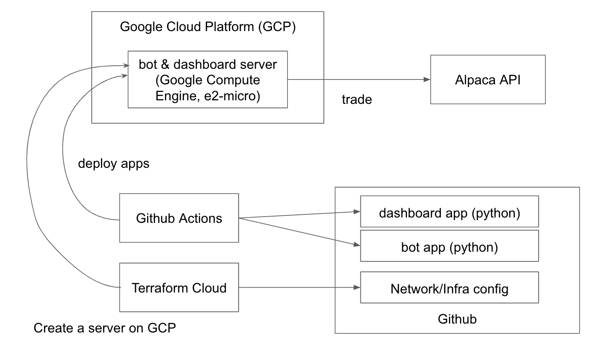
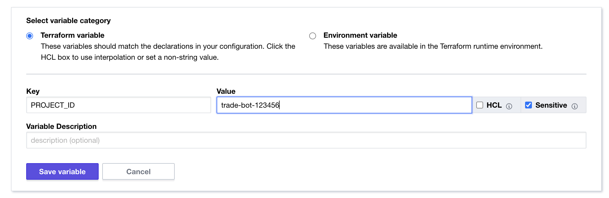
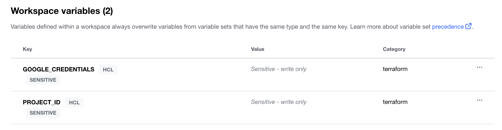

# Bot environment setup

In order to operate an automated trading bot, it is necessary to prepare a mechanism that 
allows the bot to automatically run without the operator having to start and stop it manually.
This is a high hurdle for those who are not experts in infrastructure or networking. 
Even if they know complex machine-learning algorithms, they may find it difficult to put them into actual operation.

In this repository, We will explain how to build a simple environment for running a bot.
Even if you do not understand some network/infrastructure/cloud computing terms,
we aim for you to be able to start bot operation by following the steps.

Of course, we are aware that this is not enough to operate a full-fledged, production-scale service.
Databases, log collection, a mechanism to send alerts when the server is down, CD/CI, and so on would be necessary.
However, we hope this procedure will be helpful for those who are taking their first steps in automatic trading.

# Environment created by this instruction


https://docs.google.com/presentation/d/1SyGSNEX8N3V8m4CkujqgTyiVN-Eeu1zUN4UCOVIs5Ss/edit?usp=sharing

## Create a Github repository for the bot

To store the code for the bot and network/infra configuration,
a [Github](https://github.com/) repository is needed.
I created dakimura/bot repository.
You can start from forking the repo.
If you don't want to make the repository public, 
you can create an empty repository and copy-paste the contents of this repository.

## Sign up for Google Cloud Platform

To run the bot for 24/7, you need a server on which to run (deploy) the bot program.
Here we will use Google Cloud Platform (GCP). Of course, other rental servers or cloud services such as AWS and Azure are acceptable, 
but As of October 2022, GCP has a free tier that allows you to keep running a small(e2-micro) instance for free for as long as you want,
up to the maximum amount each month. Other services also offer free allowances, 
but AFAIK GCP is the only one that keeps the free allowance for a long time.

Sign up for Google Cloud Platform from [here](https://www.google.com/cloud)

### Create a project on Google Cloud Platform

To create a server resource such as an Google Compute Engine instance, 
you must first create a "project" on Google Cloud Platform.
Open the Google Cloud console https://cloud.google.com' > cloud-console,
sign in and Create a new project. I have created a project named `trade-bot`.

### install gcloud (Google Cloud SDK command line interface)

https://cloud.google.com/sdk/docs/install
Make sure the `gcloud` command is available from the terminal.

### Sign in Google Cloud and create a service account
A service account is a special type of Google account intended to represent 
a non-human user that needs to authenticate and be authorized to access data in Google APIs.

In the steps that follow, we will build our server on the Google Cloud Platform using a service called Terraform.
To automatically build a server using Terraform on your Google Cloud Platform account, 
 you need to pass the service account information to Terraform.

Let's use the `gcloud auth login` command to first make sure that the gcloud command is properly installed.
After logging in to your Google account, You have succeeded if the screen [You are now authenticated with the gcloud CLI!](https://cloud.google.com/sdk/auth_success) appears in your browser.

Let's create a service account by referring to https://cloud.google.com/iam/docs/creating-managing-service-accounts.

Confirm the GCP project you created and set the project. 
Please replace the project name(trade-bot-364400) below with your own,
```bash
 $ gcloud projects list
PROJECT_ID              NAME                  PROJECT_NUMBER
trade-bot-364400        trade-bot             406377578255

$ gcloud config set project trade-bot-364400
Updated property [core/project].
```

and create a service account.
```bash
$ gcloud iam service-accounts create trade-bot \
--description="ServiceAccount for my trading bot" \
--display-name="trade-bot"

Created service account [trade-bot].
```

Grant the `roles/owner` role (privilege) to the service account.
This is a very strong permission, so please be very careful when handling the service account.

```bash
gcloud projects add-iam-policy-binding trade-bot-364400 \
--member="serviceAccount:trade-bot@trade-bot-364400.iam.gserviceaccount.com" \
--role=roles/owner

Updated IAM policy for project [trade-bot-364400].
bindings:
- members:
  - serviceAccount:trade-bot@trade-bot-364400.iam.gserviceaccount.com
  - user:example@example.com
  role: roles/owner
etag: XXXXXXXXXXXX
version: 1
```

To pass the service account information, create a key and download it to your localhost.
https://cloud.google.com/iam/docs/creating-managing-service-account-keys#iam-service-account-keys-create-gcloud

(Please replace the local file path, service account name, and project ID to your own)
```bash
$ gcloud iam service-accounts keys create /Users/dakimura/Desktop/sa-trade-bot-private-key.json \
    --iam-account=trade-bot@trade-bot-364400.iam.gserviceaccount.com
    
created key [XXXXXXXXXXXXXXXXXXXXXXXXXXXXXXXXXXXXXXXX] of type [json] as [/Users/dakimura/Desktop/sa-trade-bot-private-key.json] for [trade-bot@trade-bot-364400.iam.gserviceaccount.com]
```
DO NOT share the downloaded private key file with anyone.

Once again, because it's important.

DO NOT share the downloaded private key file with anyone.

Also, you cannot download the private key file again. If you accidentally lose the file or share the file with someone,
please immediately delete it by the following command:
```bash
gcloud iam service-accounts keys delete /Users/dakimura/Desktop/sa-trade-bot-private-key.json --iam-account=trade-bot@trade-bot-364400.iam.gserviceaccount.com
```

## Sign up for Terraform Cloud
To configure the bot server automatically, we use Terraform Cloud.
Please register an account with [Terraform Cloud](https://app.terraform.io/public/signup/account).
and confirm your e-mail address after the registration.

### Create a workspace in Terraform Cloud
Create a workspace by following the steps at: https://www.terraform.io/cloud-docs/workspaces/creating#create-a-workspace.
[Login to Terraform Cloud](https://app.terraform.io/app).
When your infrastructure config is changed, it should be automatically applied to the infrastructure.
Terraform cloud can update the infrastructure when your code on GitHub is updated.
Let's integrate Github when creating a new workspace.

Workspaces -> "+ New Workspace" -> "Version Control Workflow" -> "Connect to a different VCS"
-> Click the down-arrow button next to "Github" -> Click "GitHub.com(Custom)"
-> Setup Provider by following the instruction.


-> Click "Connect and Continue"

After successfully integrating Terraform cloud app to Github,
You'll see the following screen:


Let's go back to the screen to create a workspace, and now you would be able to see the button with the integrated GitHub app.

Click it and choose this repository, and create a workspace.


You would be asked to set PROJECT_ID and GOOGLE_CREDENTIALS variables but skip it for now
and move to the next step.

### Register GCP Project ID & Service account key to Terraform Cloud as Environmental Variables
After creating a workspace, we register the GCP Project ID and downloaded GCP service account key to Terraform cloud.
Go to the workspace you created.


Click "Varibale" from the left pane, Choose "Add Variable", and check "Environmental Variable".


Key="GOOGLE_CREDENTIALS", Value=the content of the service account file you created.
Environmental Variable does not accept new lines, so remove the value by the following command and copy-paste.
(If)
```bash
$ brew install jq
$ jq -c < /Users/dakimura/Desktop/sa-trade-bot-private-key.json
```
Please check on `Sensitive`, and save the variable. Otherwise, the service account key value will be visible 
to other users who can see your workspace.


In the same way, add Key="PROJECT_ID", Value=trade-bot-364400"
(Replace the project ID with your own)


Click "Save Variable".


Now you should have 2 environmental variables.

### Run Terraform (apply)
Go to your workspace page -> Click "Runs" -> Click "Actions" -> "Start new run"
After Planning and Cost Estimation is done, click "Confirm & Apply"
-> Click "Confirm Plan"


Please follow the error message if you get the following:

Go to the API dashboard for your project and search the APIs that are not enabled -> enable API
https://console.cloud.google.com/apis/dashboard

Once the Run is succeeded, you will see the following:


### Enable Auto Apply
It's time-consuming to manually confirm each apply, let's enable Auto Apply for Terraform Cloud.
Go to Workspace page on Terraform Cloud -> Setting -> General 
-> check "Auto apply" under Apply Method section.

Click "Save settings".

## run the bot application
Now you have a server instance.
Let's SSH-login and run the bot.

You can SSH-login to the instance by using the following command:
(Replace the project name and instance name with your own.)
```bash
$ gcloud compute --project "trade-bot-364400" ssh --zone "us-central1-c" "bot-instance"

Warning: Permanently added 'compute.1***5' (***) to the list of known hosts.
Linux bot-instance ***-cloud-amd64 #1 SMP Debian 5.10.140-1 (2022-09-02) x86_64

The programs included with the Debian GNU/Linux system are free software;
the exact distribution terms for each program are described in the
individual files in /usr/share/doc/*/copyright.

Debian GNU/Linux comes with ABSOLUTELY NO WARRANTY, to the extent
permitted by applicable law.
dakimura@bot-instance:~$ sudo -s
root@bot-instance:/home/dakimura#
root@bot-instance:/home/dakimura# apt install pip
```
For now, let's copy-paste the source files and requirements.txt, and directly run the bot.

```bash
$ pip install -r requirements.txt
# run as a background process
$ nohup streamlit run --server.port=80 bot.py >>bot.log 2>&1 &
$ cat bot.log
nohup: ignoring input

Collecting usage statistics. To deactivate, set browser.gatherUsageStats to False.


  You can now view your Streamlit app in your browser.

  Network URL: http://***:80
  External URL: http://***:80
```

You can see `External URL: http://***:80`
at the end of the log. Let's access the URL.


Congrats!
Now you are running your bot, and you can see the dashboard via the Internet.

## Continuous Delivery and Integration using Github Actions
Go to Terraform Cloud -> Workspace -> Set Terraform Variable:
Key=REPO_NAME, Value=dakimura/bot (replace with your own repo name)

Go to the [dashboard of your GCP project](https://console.cloud.google.com/home/dashboard) and check the project name and number.

Copy `.github/` directory to your repository, open `main.yml`, and change the following lines to your project name and number.

-> commit and push the change.

```bash
workload_identity_provider: 'projects/{YOUR PROJECT ID}/locations/global/workloadIdentityPools/gh-oidc-pool/providers/github-actions'
service_account: 'github-actions@{YOUR PROJECT NUMBE}.iam.gserviceaccount.com'
```

## FAQ

### What are Terraform and Terraform cloud, and why are they necessary?

Terraform is an open-source infrastructure as code(IaC) software tool that
enables you to safely and predictably create, change, and improve infrastructure.
Here we are going to build a server for the bot, but probably you don't want to care about:
- Does the server cost a lot?
- Is the server opening a proper port?
- Can I delete the server when I want to?

You don't have to worry because all those kind of settings are stored in the text files (.tf files) on this repository.
You can reproduce the infrastructure anytime without learning much about Google Cloud.

In short, Terraform will manage the state of your server and network settings.
To store the state, Terraform needs to be integrated with your Github repository and GCP account.
Terraform Cloud does it, and you don't have to care where the Terraform commands are run.

As of October 2022, Terraform Cloud is free to use for up to 5 users with unlimited number of workspaces. 
https://www.hashicorp.com/products/terraform/pricing

Of course, you can build a server and network infrastructure at GCP console(=Web UI), 
so Terraform is not a must if you know how to do it.

### Your python code uses Streamlit. Why don't you use Streamlit Cloud?

https://discuss.streamlit.io/t/does-streamlit-has-a-maximum-run-time-for-functions/22452/3
Streamlit is intended for web applications such as dashboard feature, and it has processing timeouts.
So we determined that it is not suitable for bot applications that persistently retrieve data and make trades without any action from the user.

### Install Terraform command line interface

Choose "Try an example configuration" at https://app.terraform.io/app/getting-started
and install Terraform command by following the instruction.
https://app.terraform.io/app/getting-started/example

I'm using mac, so installed it by the following 2 commands:
```bash
$ brew tap hashicorp/tap
$ brew install hashicorp/tap/terraform

$ terraform --version
Terraform v1.3.1
on darwin_arm64
```


### Don't we use Docker?
Actually, we should use Docker.
But it's time-consuming to register the docker image to Google Container Registry and 
configure the permission to pull the image from the GCE instance, so we think it as a nice-to-have but not must-have thing.

Also, because we are using a tiny([e2-micro](https://cloud.google.com/compute/vm-instance-pricing?hl=ja#e2_sharedcore_machine_types)) instance,
so we should not use much resource to the Docker daemon.

### Don't we register the bot as a systemctl service?
For simplicity, we didn't explain how to do it.
You can do so if you know how to do it.

### Don't we use Workload Identity Federation for Terraform Cloud?
Apparently Workload Identity Federation is not supported by Terraform Cloud yet.
https://discuss.hashicorp.com/t/workload-identity-federation-to-integrate-terraform-cloud-with-gcp/40334